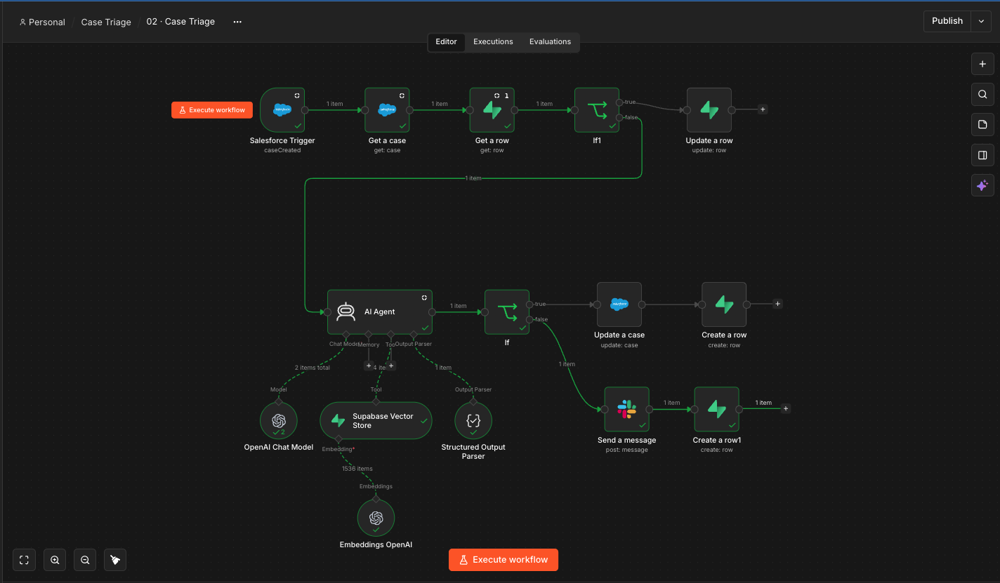
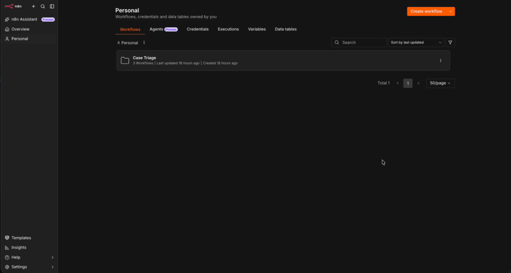

# AI Case Triage — n8n

An event-driven n8n workflow that **triages incoming support cases**: it
classifies, prioritizes, drafts a grounded first reply, routes the easy ones
automatically, and escalates only the uncertain ones to a human.



> Low-code companion to my code-based agent project — *the same kind of
> automation, shipped two ways.*

---

## The problem

Support cases arrive faster than a human can triage them. Every case needs
someone to read it, pick a category and priority, route it to the right queue,
and write a first reply. That first pass is repetitive and slow, so cases sit
unassigned.

**Goal:** automate the first pass and keep a human only for the hard or risky
ones — with the AI's decisions logged so they can be measured later.

## What it does

For every new Salesforce `Case`:

1. **Skips work already done** — an idempotency guard checks `processed_cases`.
2. **Decides** via an LLM agent: category, priority, confidence, target queue,
   and a **KB-grounded** suggested reply.
3. **Gates on confidence (0.7)**:
   - `≥ 0.7` → **auto-route**: updates the case (queue, priority, reply draft).
   - `< 0.7` → **escalate**: posts one Slack alert for a human.
4. **Audits every decision** to `case_triage_audit`.
5. **Dead-letters failures** through a dedicated error workflow.



## Architecture

Three workflows:

| # | Workflow | Role |
|---|----------|------|
| 1 | **KB Indexer** | Scheduled. Pulls the Confluence space, chunks it, embeds it, and (re)loads the Supabase vector store. |
| 2 | **Case Triage** | The main flow: trigger → dedupe → agent → confidence gate → route/escalate → audit. |
| 3 | **Error Handler** | Triggered on failure by W1/W2: writes to `failed_cases` and alerts `#triage-errors`. |

```
Salesforce Trigger (Case created)
      │
 Get a case
      │
 Get processed_cases ──► exists? ──yes─► stop
      │ no
   AI Agent ──(tool)── Supabase Vector Store (KB retrieval)
      │        (chat model + structured output parser)
   Confidence ≥ 0.7?
      ├─ yes → Update Case (queue/priority/reply) → audit(auto-routed)
      └─ no  → Slack escalation                  → audit(escalated)
```

## Design decisions

- **Event-driven, not polled** — a Salesforce trigger fires per case.
- **Agentic RAG** — the agent calls the KB retriever as a **tool** and decides
  when to look things up, grounding the draft reply in real policy articles.
- **Confidence gate** — the AI only acts autonomously when it's sure; otherwise
  a human owns it.
- **Idempotency** — `processed_cases` prevents double-processing.
- **Exceptions-only Slack** — no per-case spam; humans only see low-confidence
  and critical cases.
- **Every decision audited** — category, priority, confidence, model, and action
  are logged so accuracy can be measured and regressions caught.

## Observability & measurement

Every triage decision is written to `case_triage_audit`
(`case_id, category, priority, confidence, model, action`). That turns the
workflow from "it ran" into something you can score: how often the AI acts
autonomously, how confident it is, and — joined against outcomes — whether it
was right.

## Stack

**n8n** (self-hosted) · **Salesforce** (trigger + case updates) ·
**Confluence** (knowledge base) · **Supabase/pgvector** (vector store + audit
tables) · **OpenAI** (`gpt-5-nano` + `text-embedding-3-small`) ·
**Slack** (exceptions + errors).

## Repo layout

```
workflows/     Sanitized n8n workflow exports (import these)
sql/schema.sql Supabase tables (vector store + audit/idempotency/dead-letter)
assets/        Screenshot + run demo
```

## How to run it

1. Create the Supabase tables: run `sql/schema.sql`, and add the
   `match_documents` function from n8n's Supabase vector-store template.
2. Import the three JSON files from `workflows/` into n8n.
3. Create credentials (Salesforce OAuth2, Confluence OAuth2, Supabase
   service-role, OpenAI, Slack) and attach them to the nodes.
4. Re-point the Confluence **site** and the Slack **channel** to your own
   (they're placeholders in the exports).
5. Publish the workflows and set **03 · Error Handler** as the Error Workflow
   for 01 and 02.

> Credentials and org-specific values are stripped from the exports — nothing
> here points at a live instance.

## Failure modes & what I'd improve

- **Retrieval-as-tool quirks** — n8n's vector-store-as-tool can be flaky with
  some models; a sub-workflow tool is the more robust path at scale.
- **Confidence as a string** — the parser can return `confidence` as text;
  it's coerced with `Number()` before the gate.
- **Idempotency at scale** — the guard is a fast exact-match lookup; a true
  upsert would make re-runs fully safe.
- **Next:** an automated eval set scoring the agent's category/priority against
  a human-labelled sample, and a daily digest instead of per-exception alerts.
